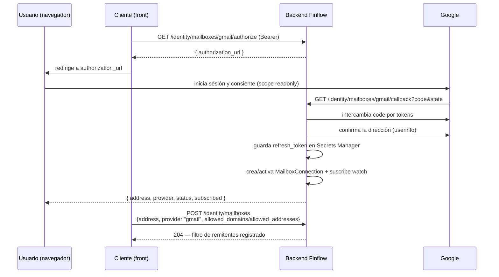

# Cómo un usuario conecta su buzón (guía de backend)

Contrato de API para el cliente (front, u otro backend) que lleva a un usuario
autenticado a autorizar la lectura de su correo. Esto es solo el lado del
backend: qué endpoint llamar, en qué orden y qué esperar de vuelta. La UI que
lo envuelve — pantallas, textos, redirecciones del navegador — es decisión del
front y no vive aquí.

Para el porqué del modelo (nada de reenvíos, solo remitentes aprobados,
lectura de solo lectura) ver [overview.md](overview.md#el-modelo-de-entrada).
Para levantar Gmail en una cuenta de Google real, ver
[running.md](running.md#5-conectar-gmail).

## Dos piezas separadas, siempre

"Conectar un buzón" son en realidad dos cosas distintas, y la API las trata
así a propósito:

1. **La conexión** — que el proveedor nos dio permiso de solo lectura sobre
   una dirección concreta. Vive en Ingestion (`mailbox_connections`).
2. **El filtro de remitentes** — a qué direcciones/dominios se les permite
   generar transacciones desde ese buzón. Vive como una *inbox* (`user_inboxes`).

Una conexión sin filtro de remitentes queda **conectada pero no lee nada** —
es el valor seguro por defecto, nunca "leer todo mientras tanto". Por eso
`POST /identity/mailboxes` (ver más abajo) siempre registra ambas cosas en un
solo paso: separar "conectar" de "elegir remitentes" en dos llamadas dejaría
un estado en el que el usuario cree que ya quedó listo y no llega nada.

Con el proveedor **simulado**, la dirección la decide quien llama, así que las
dos piezas se resuelven en una sola llamada. Con **Gmail real**, la dirección
solo la confirma Google — nunca se acepta la que mande el cliente, para que
nadie pueda apuntar el correo de otra persona a su propia cuenta — así que el
filtro de remitentes se registra en un segundo paso, una vez que el `callback`
de OAuth ya dijo qué dirección fue autorizada.

## Flujo A — Gmail (producción)

Requiere que el despliegue tenga Gmail configurado (los cuatro
`INGESTION_GMAIL_*`, ver [running.md](running.md#5-conectar-gmail)); si no,
`/gmail/authorize` responde `503`.



### 1. Pedir la URL de consentimiento

```
GET /identity/mailboxes/gmail/authorize
Authorization: Bearer <jwt del usuario>
```

```json
{ "provider": "gmail", "authorization_url": "https://accounts.google.com/o/oauth2/v2/auth?..." }
```

Devuelve la URL en vez de redirigir directamente porque quien llama es un
front que puede querer explicar qué se va a pedir antes de mandar al usuario a
Google. El `state` va firmado (HMAC con `INGESTION_OAUTH_STATE_SECRET`) y
codifica el `user_id` — es lo único que ata el `callback` a quien lo inició, y
expira.

### 2. El usuario consiente en Google

El cliente manda al navegador del usuario a `authorization_url`. Ahí Google
pide dos scopes, ambos de solo lectura: `gmail.readonly` y `userinfo.email`
(esta última para poder confirmar qué dirección se autorizó). El backend
siempre fuerza `prompt=consent`, porque sin eso una reautorización no trae
`refresh_token` — y una reautorización es justo el caso en que hace falta uno
nuevo.

### 3. Google redirige de vuelta

```
GET /identity/mailboxes/gmail/callback?code=...&state=...
```

Esta llamada la hace el navegador del usuario siguiendo un redirect, **no**
lleva `Authorization: Bearer` — no puede, es Google quien redirige. La
identidad del usuario viaja únicamente en el `state` firmado del paso 1; el
backend lo valida antes de tocar nada más.

Si el usuario dice que no, o Google devuelve `error` en vez de `code`, la
respuesta es `400` y no se guarda nada.

Con `code` válido, el backend, en orden:

1. Intercambia el código por tokens con Google.
2. Exige que haya `refresh_token` — si no vino, `400` (`MailboxAuthorizationError`):
   sin él solo habría una hora de acceso antes de que el buzón dejara de
   funcionar en silencio.
3. Confirma con Google **qué dirección** fue realmente autorizada — nunca se
   confía en una dirección que mandara el cliente.
4. Guarda el `refresh_token` en Secrets Manager, antes de crear la conexión:
   una conexión sin token guardado se vería sana y fallaría en la primera
   lectura.
5. Crea o reactiva la `MailboxConnection` (`status: active`).
6. Suscribe el `watch` de Gmail de inmediato (no espera al barrido
   programado), para que las notificaciones empiecen a llegar ya.

```json
{ "address": "yo@gmail.com", "provider": "gmail", "status": "active", "subscribed": true }
```

`subscribed: false` significa: quedó conectado pero la suscripción no se pudo
levantar todavía (Google no respondió, por ejemplo). No es un error — el
barrido programado la reintentará — pero vale la pena mostrarlo en vez de
esconderlo.

En este punto **el buzón todavía no lee nada**: no tiene remitentes
aprobados. Falta el paso 4.

### 4. Registrar los remitentes aprobados

```
POST /identity/mailboxes
Authorization: Bearer <jwt del usuario>
Content-Type: application/json

{
  "address": "yo@gmail.com",
  "provider": "gmail",
  "allowed_domains": ["an.notificacionesbancolombia.com"],
  "allowed_addresses": []
}
```

`address` y `provider` deben ser exactamente los que devolvió el `callback`.
Llamar esto es seguro aunque la conexión ya exista (reconectar conserva el
cursor, no vuelve a leer todo el buzón desde cero); es intencional poder
llamarlo de nuevo más adelante para ampliar o reducir la lista de remitentes.

`204 No Content` si quedó bien. `409` si esa dirección ya está conectada por
**otro** usuario — nunca se reasigna un buzón ajeno.

A partir de aquí, cada vez que Google detecta un cambio publica en Pub/Sub y
el backend lo recibe en `POST /ingestion/mailbox-events/gmail`; eso ya no
requiere ninguna llamada del cliente.

## Flujo B — proveedor simulado (desarrollo)

Sin OAuth ni Google: una sola llamada, porque aquí sí se confía en la
dirección que manda el cliente (no hay proveedor real que la confirme).

```
POST /identity/mailboxes
Authorization: Bearer <jwt del usuario>
Content-Type: application/json

{
  "address": "yo@gmail.test",
  "provider": "simulated",
  "allowed_domains": ["an.notificacionesbancolombia.com"],
  "allowed_addresses": []
}
```

`204` y el buzón queda conectado y filtrado en el mismo paso. Ejemplo completo
punta a punta (crear cuenta, conectar, dejar un correo, tocar el timbre) en
[running.md §4](running.md#4-probar-el-camino-completo).

## Ponerse al día con el mes en curso (backfill opcional)

Un usuario puede registrarse cualquier día del mes, no solo el primero. La
sincronización ordinaria (`/refresh`, el webhook, la suscripción push) **solo
lee hacia adelante desde el momento en que se conecta el buzón** — es la misma
regla de privacidad de siempre: nunca se escanea el historial de alguien por
defecto. Sin más, eso dejaría un primer mes con un hueco: todo lo que llegó
antes de conectar simplemente no se lee nunca.

`POST /identity/mailboxes/backfill` es la única excepción, y es explícitamente
opt-in: léelo como el botón "traer lo que ya tengo este mes" que se ofrece justo
después de conectar un buzón.

```
POST http://localhost:8000/identity/mailboxes/backfill
Authorization: Bearer <tu token>
```

```json
{
  "mailboxes": 1,
  "fetched": 12,
  "accepted": 9,
  "duplicates": 3,
  "needs_reauth": 0,
  "since": "2026-08-01"
}
```

Cómo funciona, y sus límites:

- Busca desde la medianoche UTC del día 1 del mes en curso hasta ahora, en
  **todos** los buzones activos del usuario, con el mismo filtro de
  remitentes aprobados que todo lo demás — nunca lee sin ese filtro.
- Va por la misma ruta de deduplicación que la sincronización ordinaria: un
  correo que ya se había leído (por ejemplo, porque llegó después de conectar
  y ya lo tomó el webhook) vuelve como `duplicates`, nunca se cuenta dos veces.
  Por eso es seguro llamarlo más de una vez.
- **No mueve el cursor de la sincronización incremental.** Son caminos
  independientes a propósito: un backfill no puede hacer que la sincronización
  ordinaria se salte correo, y la sincronización ordinaria no puede hacer que
  un backfill futuro crea que ya cubrió un rango que en realidad nunca leyó.
- Con Gmail, esto usa una búsqueda directa (`messages.list`) en vez del
  historial incremental: Gmail solo conserva ~7 días de historial, muy poco
  para "desde el día 1 del mes". Tiene un tope de 500 mensajes por buzón —
  de sobra para alertas bancarias de un mes; si algún día se excede, queda un
  aviso en los logs, nunca un corte silencioso.

## Mantener la conexión viva

Una suscripción de Gmail caduca a los 7 días **sin avisar** — nada falla, los
correos simplemente dejan de llegar. El cliente no tiene que gestionar esto,
pero sí conviene que llame esto al abrir la app:

```
POST /identity/mailboxes/refresh
Authorization: Bearer <jwt del usuario>
```

```json
{ "mailboxes": 2, "fetched": 3, "accepted": 3, "needs_reauth": 0 }
```

Hace una sincronización inmediata (por si el proveedor notificó y el webhook
no llegó) y renueva cualquier suscripción cerca de caducar, de paso. Es uno de
los tres disparadores de renovación — los otros dos son cada notificación
recibida y el barrido programado (`just subscriptions-prod --watch` en
producción) — así que un usuario que simplemente usa la app mantiene sus
propios buzones vivos incluso si el barrido no está corriendo.

## Ver el estado de los buzones conectados

```
GET /identity/mailboxes
Authorization: Bearer <jwt del usuario>
```

```json
{
  "mailboxes": [
    { "address": "yo@gmail.com", "provider": "gmail", "status": "active", "needs_attention": false }
  ]
}
```

| `status` | Qué significa | Qué hacer |
|---|---|---|
| `active` | Todo bien; se está leyendo con el filtro configurado. | Nada. |
| `needs_reauth` | El proveedor dejó de aceptar nuestras credenciales — el usuario revocó el acceso, o el grant caducó solo. `needs_attention: true`. | Repetir el flujo A desde el paso 1: pedir de nuevo `/gmail/authorize`. |
| `revoked` | El propio usuario desconectó el buzón. | Nada que mostrar como error — fue una elección, no una falla. |

> **Mientras la app de OAuth siga en modo Testing** (sin verificación de
> Google — ver [running.md §5](running.md#5-conectar-gmail)), el
> `refresh_token` caduca cada 7 días y cada usuario tiene que volver a pasar
> por el flujo A. Eso es exactamente lo que reporta `needs_reauth`.

## Desconectar

```
DELETE /identity/mailboxes
Authorization: Bearer <jwt del usuario>
Content-Type: application/json

{ "address": "yo@gmail.com", "provider": "gmail" }
```

`204`. Marca la conexión como `revoked` — no la borra ni descarta el cursor de
lectura — para que un usuario que reconecte más tarde retome donde quedó en
vez de que el sistema vuelva a leer todo el buzón desde el principio. `404` si
esa dirección no está conectada por este usuario.

## Errores que puede devolver este contrato

| Código | Cuándo | Cuerpo típico |
|---|---|---|
| `400` | `state` inválido/expirado; el usuario negó el consentimiento; Google rechazó el `code`; falta `refresh_token`. | `{"detail": "..."}` |
| `401` | Falta o es inválido el `Authorization: Bearer`. | — |
| `409` | `POST /identity/mailboxes` con una dirección ya conectada por **otro** usuario. | `{"detail": "That mailbox is already connected"}` |
| `422` | Cuerpo inválido (dirección sin `@`, campos vacíos donde no debería). | `{"detail": "..."}` |
| `503` | `/gmail/authorize` sin Gmail configurado en el despliegue, o Google inalcanzable durante el `callback`. | `{"detail": "..."}` |

## Lo que el cliente nunca ve ni maneja

- El `refresh_token` no sale nunca de este backend: se guarda en Secrets
  Manager y ningún endpoint lo expone. El cliente nunca lo recibe, lo
  reenvía ni lo cachea.
- El `access_token` de Gmail se deriva del `refresh_token` en cada uso —
  tampoco se expone.
- El histórico de sincronización (`cursor`, `historyId` de Gmail) es un
  detalle interno del adaptador; no forma parte de este contrato.
