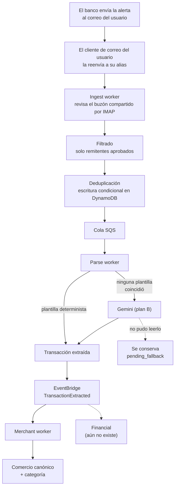

# Finflow — qué es y cómo funciona

Finflow es un backend de finanzas personales dirigido por eventos. Su objetivo
es que nadie tenga que registrar un gasto a mano: procesa los correos que el
banco ya envía, extrae cada movimiento, normaliza el comercio, actualiza saldos
y mantiene el patrimonio neto al día.

Se entrega como **aplicación web**, accesible desde el navegador del teléfono.
Deliberadamente no es una app nativa, así que no hay revisión de tienda de por
medio. Cuando en este repositorio se dice "la app" se habla de este software.

**Escala**: un despliegue privado para el autor y un puñado de amigos, cada uno
viendo solo sus propias finanzas. Eso justifica muchas decisiones — capa
gratuita de AWS, nada de sharding multi-tenant — pero el aislamiento por
usuario es estricto de todos modos.

## El modelo de entrada

Cada usuario **reenvía** las alertas de su banco a una dirección propia
(`algo+alias@gmail.com`) sobre **una sola cuenta de Gmail que la app misma
posee**. Un worker la revisa por IMAP; nunca se lee el buzón personal de
nadie, y no hay pantalla de consentimiento de por medio.

Esto no es un detalle de implementación, es la decisión central del producto:

- **El usuario configura el reenvío en su propio cliente de correo.** Es una
  regla de filtro ("todo lo que venga de mi banco, reenvíalo"), no algo que
  nosotros gestionamos por él.
- **La aprobación de remitentes sigue mandando.** Un correo reenviado solo se
  acepta si viene de un remitente que ese usuario aprobó explícitamente; una
  lista vacía significa *no aceptar nada*, nunca *aceptarlo todo*.
- **Nunca se lee un buzón ajeno.** La única bandeja que este sistema abre es
  la que él mismo controla, y solo para esto.

El contrato de API — cómo un usuario obtiene su dirección de reenvío y aprueba
remitentes — está en [email-forwarding.md](email-forwarding.md).

## El flujo principal

Dos propiedades gobiernan toda la cadena:

**Primero lo determinista, siempre.** Una plantilla es barata, repetible y
auditable. El modelo de lenguaje solo se consulta cuando todas las plantillas
del banco fallaron, y lo que devuelve pasa por un esquema Pydantic y después
por los objetos de valor del dominio. Si algo no cuadra, el correo se conserva
sin parsear en vez de inventarse una transacción.

**La entrega es at-least-once.** Todo el sistema asume que el mismo mensaje
puede llegar dos veces: la identidad de una notificación se deriva del usuario
más el `Message-ID`, la deduplicación es una escritura condicional en DynamoDB,
y ningún contador se incrementa sin haber reclamado antes el `event_id` del
evento que lo provocó.

## Los contextos acotados

Cada contexto es dueño de su modelo y no importa agregados, repositorios ni
servicios de dominio de otro. La única superficie de integración permitida es
un caso de uso publicado, llamado desde un adaptador en la capa de
infraestructura de quien llama — o, entre contextos asíncronos, un evento de
integración en EventBridge.

### Ingestion

El buzón de ingesta compartido, la asignación de direcciones de reenvío,
filtrado por remitente, deduplicación, parseo y extracción. Publica un único
evento hacia afuera: `TransactionExtracted`. Todo su ciclo de vida interno
(recibido, encolado, ignorado, fallido) se queda dentro.

La dirección de reenvío de un usuario (`finflowingest+<id>@gmail.com`) es una
función pura de su `user_id` — no hay nada que asignar ni que pueda colisionar.
El `ingest worker` revisa esa única cuenta por IMAP en un bucle con espera
entre pasadas (no hay equivalente a *long polling* en IMAP), y marca cada
correo como leído solo después de haberlo entregado de forma durable — un
reintento tras una caída vuelve a leerlo, nunca lo pierde.

### Merchant

Identidad canónica de comercios, alias y clasificación. Un **comercio** es un
padre; sus **hijos** son cada grafía que un banco ha usado para él. Solo se
llega al padre a través de los hijos.

El reconocimiento tiene cuatro niveles, en orden de cuánto asumen:

1. **Huella exacta** — la misma grafía ya vista. Ahí aterriza casi todo.
2. **Root key** — la grafía sin números de tienda, colas de dirección, formas
   jurídicas ni palabras genéricas. Mismo nombre módulo ruido, mismo padre.
3. **Submarca** — la raíz extiende a otra en frontera de token
   (`EXITO EXPRESS` bajo `EXITO`). Solo para compras, nunca para
   transferencias, que nombran personas.
4. **El modelo** — solo si todo lo anterior falló. Sabe lo que ningún
   normalizador puede: que `BANCOLOMBIA NEQUI` y `NEQUI` son una empresa.

El sesgo que decide cada empate: **agrupar mal etiqueta dinero y se esconde;
no agrupar cuesta un clic que se recuerda para siempre.** Por eso los niveles
3 y 4 marcan lo que proponen como *sugerencia* revisable, y una corrección del
usuario le gana a cualquier regla de forma permanente.

### Identity

Cuentas, credenciales y autenticación. También expone la bandeja (dirección de
reenvío + remitentes aprobados) de cada usuario autenticado, delegando en los
casos de uso de Ingestion a través de un adaptador propio — nunca calcula la
dirección ella misma.

### Financial

Cuentas, transacciones, saldos, deuda y patrimonio neto.

> **Aún no está implementado.** Los directorios existen pero están vacíos.
> `TransactionExtracted` sale al bus y hoy solo lo escucha Merchant. Este es el
> siguiente paso natural del proyecto: es lo que convierte todo lo anterior en
> un saldo que alguien puede mirar.

## Decisiones que conviene conocer

**El dinero nunca es un float.** Es `Decimal` en el dominio y una *cadena* en
los payloads de integración: un float JSON pierde centavos antes de que
Financial llegue a verlos.

**Los eventos de integración se construyen campo por campo.** Un evento de
dominio solo llega a EventBridge si el traductor de su propio contexto lo mapea
explícitamente. Añadir un campo a un agregado nunca puede ensanchar en silencio
lo que otros contextos reciben.

**El contenido de un correo y la salida del modelo son datos no confiables.**
Ambos se validan en el borde y se vuelven a validar en el dominio.

**Un secreto nunca se escribe en código ni en un log.** La contraseña de
aplicación de la cuenta de ingesta vive en variables de entorno, nunca en
código; las contraseñas de usuario solo cruzan hacia el almacenamiento ya
hasheadas; y la app se niega a arrancar si falta un secreto obligatorio —
incluida la dirección de ingesta misma, sin la cual nadie podría registrarse.

**El webhook de notificaciones bancarias es una costura de pruebas**, no un
camino de producto. Está montado únicamente cuando `ENVIRONMENT=local`.

## Stack

Python 3.13 (fijado), FastAPI, Pydantic v2, uv como único gestor de
dependencias, `just` para las tareas del proyecto. En AWS: DynamoDB, SQS,
EventBridge. Autenticación con bcrypt y JWT. Gemini como plan B de extracción y
clasificación. El DevContainer de VS Code es el entorno de desarrollo canónico.

---

Para levantar y probar todo esto, ver [running.md](running.md).
